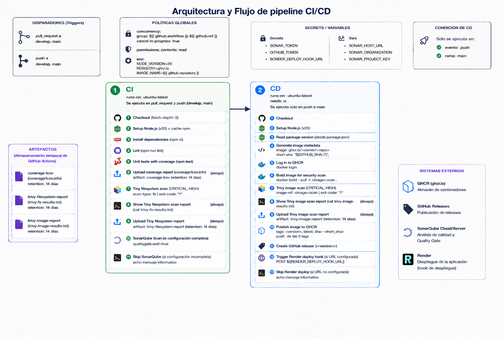

# Flujo CI/CD

El workflow `.github/workflows/ci-cd.yml` está organizado en dos jobs:

- `CI`: validación de código, pruebas, cobertura, seguridad y calidad.
- `CD`: construcción, publicación, release y despliegue.

## Arquitectura



## Disparadores

El workflow se ejecuta en:

- Pull request hacia `develop`.
- Pull request hacia `main`.
- Push a `develop`.
- Push a `main`.

La configuración:

```yaml
concurrency:
  group: ${{ github.workflow }}-${{ github.ref }}
  cancel-in-progress: true
```

cancela una ejecución anterior de la misma rama o pull request cuando llega un commit nuevo.

## Matriz de ejecución

| Evento | CI | CD |
|---|---:|---:|
| Pull request a `develop` | Si | No |
| Pull request a `main` | Si | No |
| Push a `develop` | Si | No |
| Push a `main` | Si | Si |

El job `CD` depende de `CI` y utiliza:

```yaml
needs: ci
if: ${{ github.event_name == 'push' && github.ref == 'refs/heads/main' }}
```

Esto garantiza que:

- `CD` solo comienza cuando `CI` termina correctamente.
- Un pull request nunca publica imágenes, crea releases ni despliega.
- Un push a `develop` solo ejecuta validaciones.
- Solo un push o merge completado en `main` ejecuta entrega y despliegue.

## Job CI

El job `CI` se ejecuta en todos los eventos configurados.

### Checkout

Descarga el repositorio con el historial Git completo:

```yaml
fetch-depth: 0
```

El historial completo permite un análisis más preciso en SonarQube Cloud.

### Instalación

Configura Node.js 20, habilita la caché de npm e instala las versiones exactas de `package-lock.json`:

```bash
npm ci
```

### Lint

Ejecuta:

```bash
npm run lint
```

Un error de ESLint detiene el job.

### Pruebas y cobertura

Ejecuta:

```bash
npm test
```

Jest valida una cobertura global mínima de 70%. El archivo `coverage/lcov.info` se publica como artefacto durante 14 días.

### Trivy filesystem

Analiza el código y las dependencias del repositorio en busca de vulnerabilidades `MEDIUM`, `HIGH` y `CRITICAL`.

El reporte:

- Se muestra en el log del job.
- Se publica como `trivy-filesystem-report`.
- Se conserva durante 14 días.

Actualmente utiliza:

```yaml
exit-code: '1'
```

Por lo tanto, si Trivy detecta una vulnerabilidad dentro de las severidades configuradas, el step falla, detiene `CI` e impide que `CD` se ejecute.

### SonarQube Cloud

El análisis de Sonar se ejecuta dentro del mismo job y utiliza directamente la cobertura generada por Jest.

Analiza:

- Código fuente en `src/`.
- Pruebas en `test/`.
- Cobertura en `coverage/lcov.info`.
- Resultado del Quality Gate.

La propiedad:

```text
sonar.qualitygate.wait=true
```

hace que `CI` espere el resultado del Quality Gate. Si el gate falla, `CI` falla y `CD` no se ejecuta.

Configuración requerida:

| Tipo | Nombre | Descripción |
|---|---|---|
| Secret | `SONAR_TOKEN` | Token de autenticación |
| Variable | `SONAR_HOST_URL` | `https://sonarcloud.io` |
| Variable | `SONAR_ORGANIZATION` | Organización de SonarCloud |
| Variable | `SONAR_PROJECT_KEY` | Clave del proyecto |

Si la configuración está incompleta, el step registra que Sonar fue omitido.

## Job CD

El job `CD` depende de `CI` y solo se ejecuta en push a `main`.

Declara los permisos:

```yaml
permissions:
  contents: write
  packages: write
```

Estos permisos permiten crear el release y publicar en GitHub Container Registry.

### Versión y metadatos

Lee la versión desde `package.json` y obtiene los siguientes datos:

- Versión semántica.
- Nombre de imagen basado en `github.repository`.
- SHA corto del commit.

### Autenticación en GHCR

Inicia sesión mediante comandos Docker y el token temporal generado por GitHub:

```bash
echo "$GITHUB_TOKEN" | docker login ghcr.io --username "$GITHUB_ACTOR" --password-stdin
```

No requiere crear manualmente el secret `GITHUB_TOKEN`.

### Construcción y seguridad

Construye la imagen:

```bash
docker build --pull --tag "ghcr.io/<owner>/<repo>:scan" .
```

Después, Trivy analiza la imagen antes de publicarla.

El reporte:

- Se muestra en el log.
- Se publica como `trivy-image-report`.
- Se conserva durante 14 días.

El scan utiliza `exit-code: '1'`. Si detecta una vulnerabilidad dentro de las severidades configuradas, detiene `CD` antes de publicar la imagen, crear el release o desplegar en Render.

### Publicación en GHCR

La misma imagen analizada recibe y publica tres tags:

```text
ghcr.io/ronny854/devops-eval-api-business-it:1.0.0
ghcr.io/ronny854/devops-eval-api-business-it:latest
ghcr.io/ronny854/devops-eval-api-business-it:sha-<short_sha>
```

Los comandos utilizados son `docker tag` y `docker push`.

### GitHub Release

Crea un release con:

```text
v<version>
```

Las notas se generan automáticamente a partir de los cambios incluidos.

### Despliegue en Render

Después de publicar la imagen y crear el release, el mismo job llama al deploy hook:

```text
RENDER_DEPLOY_HOOK_URL
```

El servicio de Render debe existir previamente. Si el secret no está configurado, el step registra que el despliegue fue omitido.

## Artefactos

| Artefacto | Job | Contenido | Retención |
|---|---|---|---:|
| `coverage-lcov` | CI | Reporte de cobertura | 14 días |
| `trivy-filesystem-report` | CI | Vulnerabilidades del repositorio | 14 días |
| `trivy-image-report` | CD | Vulnerabilidades de la imagen | 14 días |

## Flujo de fallos

- Un error de lint detiene `CI`.
- Un test fallido detiene `CI`.
- Cobertura inferior al 70% hace fallar Jest y detiene `CI`.
- Un Quality Gate rechazado hace fallar `CI`.
- Si `CI` falla, `CD` no se ejecuta.
- Un error en Docker build o Docker push detiene `CD`.
- Un error al crear el release detiene `CD`.
- Un error HTTP del deploy hook detiene `CD`.
- Una vulnerabilidad detectada por Trivy filesystem detiene `CI` y evita la ejecución de `CD`.
- Una vulnerabilidad detectada por Trivy image detiene `CD` antes de publicar y desplegar.

## Pruebas y evidencias

Esta sección permite registrar las ejecuciones utilizadas en la demostración.

| Caso | Resultado esperado | Evidencia |
|---|---|---|
| Flujo completo en push a `main` | Ejecuta CI y luego CD | [Enlace de ejecución](https://github.com/ronny854/devops-eval-api-business-it/actions) |
| Pull request hacia `main` | Ejecuta CI; CD aparece omitido | [Enlace de ejecución](https://github.com/ronny854/devops-eval-api-business-it/pulls) |
| Fallo por lint | CI falla y CD no se ejecuta | [Enlace de ejecución](https://github.com/ronny854/devops-eval-api-business-it/actions/runs/27801600123) |
| Fallo por cobertura menor al 70% | Jest rechaza el umbral y CD no se ejecuta | [Enlace de ejecución](https://github.com/ronny854/devops-eval-api-business-it/actions/runs/27801720678) |
| Fallo por Trivy en imagen | CD muestra el reporte y no publica imagen, release ni despliegue | [Enlace de ejecución](https://github.com/ronny854/devops-eval-api-business-it/actions/runs/27801324432) |
| Imagen publicada en GHCR | Existen tags de versión, latest y SHA | [Abrir paquetes](https://github.com/ronny854?tab=packages) |
| GitHub Release creado | Existe un release con la versión del proyecto | [Abrir releases](https://github.com/ronny854/devops-eval-api-business-it/releases) |
| Servicio desplegado | `/health` responde con estado `ok` | [Abrir servicio](https://devops-eval-api-business-it.onrender.com/health) |

Para demostrar el comportamiento bloqueante se puede introducir temporalmente una dependencia o imagen base con una vulnerabilidad conocida dentro de las severidades configuradas. Después de capturar la evidencia, se debe restaurar la dependencia segura.

## Mejoras

### Rollback automático

Agregar un job o workflow de rollback que se active cuando fallen los smoke tests posteriores al despliegue. Debe identificar la última imagen estable por digest, desplegarla y registrar la operación.

### Aprovisionamiento completo de Render

El step actual solo invoca un deploy hook y requiere crear el servicio manualmente la primera vez. Puede mejorarse utilizando la API de Render o infraestructura como código para:

- Crear el servicio desde cero.
- Configurar plan, región y health check.
- Asociar el repositorio o imagen de GHCR.
- Configurar variables y credenciales.
- Actualizar y eliminar infraestructura de forma reproducible.

### Pruebas posteriores al despliegue

Agregar smoke tests contra `/health` y `/greet`. Si fallan, ejecutar el rollback automático.

### Estrategias de despliegue

Implementar blue/green o canary para reducir el riesgo y permitir una reversión sin indisponibilidad.

